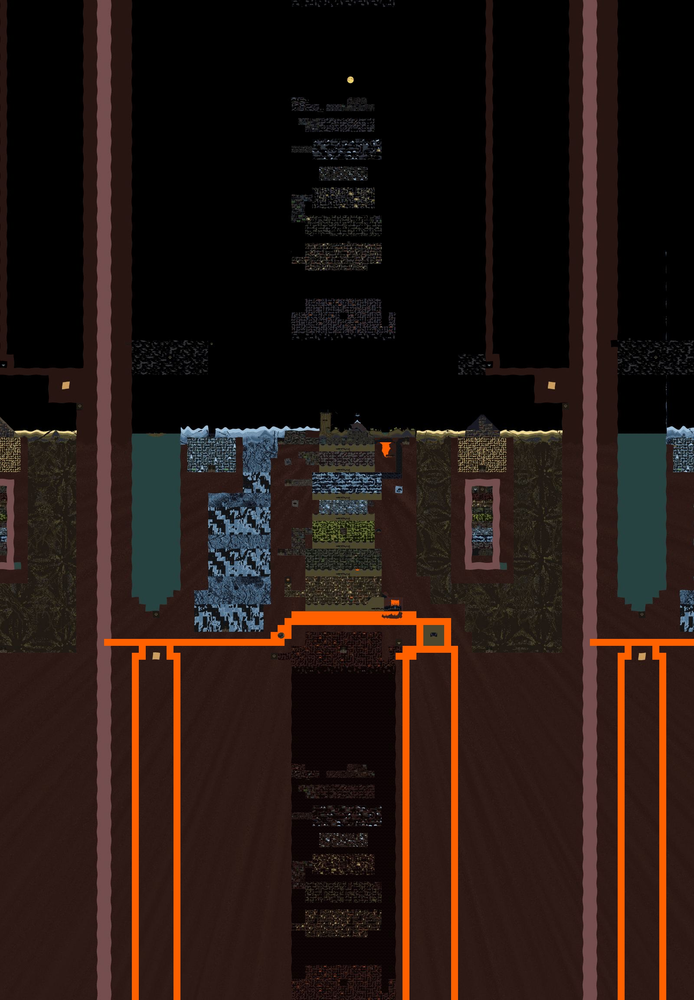

# Capture areas

A list of available capture areas.
Coordinates are in in-game "virtual" or "world" pixels.
`Right` and `Bottom` coordinates are not included in the rectangle.

The dimensions of the capture rectangle are exactly:

``` lua
Width = Right - Left
Height = Bottom - Top
```

Depending on the virtual resolution you use, the resulting capture may be a bit larger.
If you need the output to have exact dimensions, supply your needed coordinates to the stitcher tool.

Coordinate system:


## `Base layout`

This area features only the "base layout".
Everything around this area uses a similar layout, but with different materials and a different seed.

``` lua
Left = -17920
Top = -7168
Right = 17920
Bottom = 17408
```

The end result will have a size of `35840 x 24576 pixels ~= 880 megapixels`.


## `Main world`

This area features only the "base layout" plus the area above (sky) and below (hell).
It totals to a height of exactly 3 times the base layout's height.

``` lua
Left = -17920
Top = -31744
Right = 17920
Bottom = 41984
```

The end result will have a size of `35840 x 73728 pixels ~= 2642 megapixels`.


## `Extended`

This area consists of `Main world` plus fractions of the left and right parallel worlds.

``` lua
Left = -25600
Top = -31744
Right = 25600
Bottom = 41984
```

The end result will have a size of `51200 x 73728 pixels ~= 3775 megapixels`.


