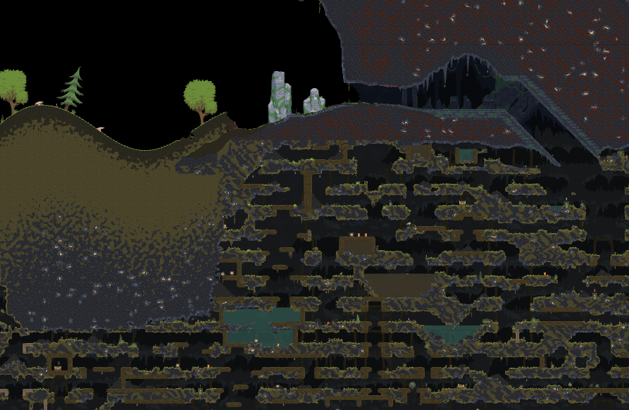

# Noita MapCapture addon

Addon that captures the map and saves it as image.

## State

Works somewhat, still in development.

**To-Do:**

- [ ] Reduce memory usage of stitching program
- [ ] Make stitching multi threaded
- [ ] Add parameters to stitching program
- [ ] Show progress while stitching
- [ ] Improve image quality, reduce artifacts
- [ ] Travis or similar for automatic builds, right now there are no executables
- [ ] Fix crash while taking screenshots

## Usage

**DLLs and executables are not included in the repo yet! They will be uploaded once releases are built automatically. The mod won't function without them!**

1. Have Noita beta installed
2. Install the repository as mod
    - mod.xml and the rest should be in `.../Noita/mods/noita-mapcap/`
3. Enable mod, and restart Noita
4. In the game you should see a `Start capturing map` text on the screen, click it
5. The screen will jump around, and the game will take screenshots automatically. Don't interfere with it. Screenshots are saved in `.../Noita/mods/noita-mapcap/output/`
6. When you think you are done, close noita
7. Start `.../Noita/mods/noita-mapcap/bin/stitch/stitch.exe`
    - It will take the screenshots from the `output` folder
8. An `output.png` with the stitched result will appear

## Advanced usage

If you use `noita_dev.exe`, you can enable the debug mode by pressing `F5`. Once in debug mode, you can use `F8` to toggle shaders (Includes fog of war), and you can use `F7` to disable the UI.

## License

[MIT](LICENSE)