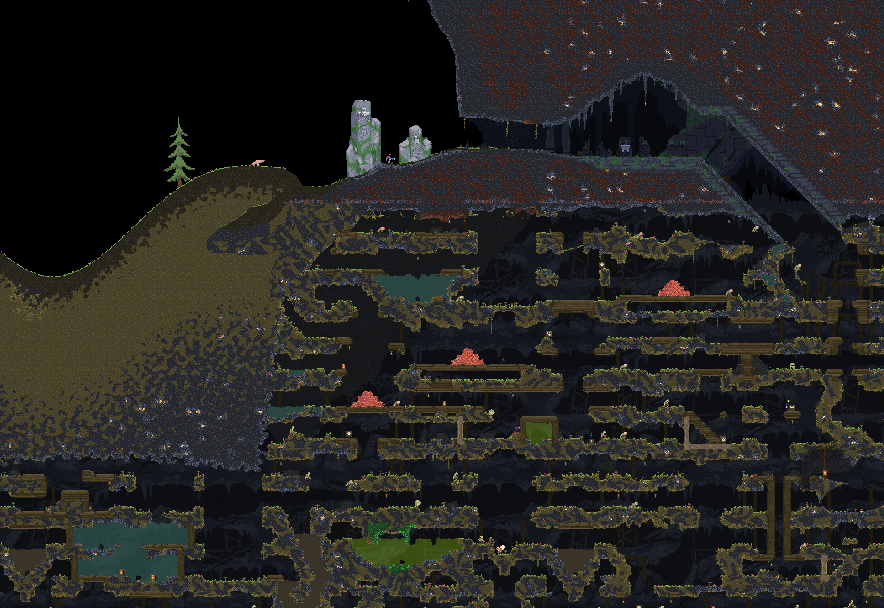

# Noita MapCapture addon [](https://travis-ci.com/Dadido3/noita-mapcap)

Addon that captures a Noita world and saves it as image.



A resulting image with nearly 3.8 gigapixels can be [seen here](https://easyzoom.com/image/223556) (Warning: Spoilers).

## System requirements

- Windows Vista, ..., 10. (64 bit OS for stitching)
- A few GB of free drive space.
- 4 or more GB of RAM for gigapixel images. (But it works with less as long as the software doesn't run out of virtual memory)
- A processor.
- Optionally a monitor, keyboard and mouse to interact with the mod/software.
- A sound card to listen to music while it's grabbing screenshots.
  Capturing and stitching the "extended" map will take about 180 minutes (160 + 20).

## Usage

1. Have Noita installed.
2. Download the [latest release of the mod from this link](https://github.com/Dadido3/noita-mapcap/releases/latest) (The `Windows.x86.7z`, not the source)
3. Unpack it into your mods folder, so that you get the following file structure `.../Noita/mods/noita-mapcap/mod.xml`.
4. Set your resolution to 1280x720, and use the `Windowed` mode. (Not `Fullscreen (Windowed)`!) If you have to use a different resolution, see [Advanced stuff](#advanced-stuff).
5. Enable the mod and restart Noita.
6. In the game you should see text on screen.
    - Either press `>> Start capturing map around view <<` to capture in a spiral around your current view.
    - Or press any other option to capture [specific areas](AREAS.md).
7. The screen will jump around, and the game will take screenshots automatically.
    - Screenshots are saved in `.../Noita/mods/noita-mapcap/output/`.
    - Don't move the game window outside of screen space. You can cover it with other windows, and continue using your PC.
    - Don't minimize the game window.
    - If you need to pause, use the ESC menu.
    - Also, make sure that the console window isn't selected, as you will end up with screenshots of the console instead of the game. You can select and use any other window while it's capturing screenshots, though.
    - Noita may crash in the process or show error messages. If you encounter an `ASSERT FAILED!` message click on `Ignore always`. If Noita crashes you can restart it, load your save and start capturing again. It will continue from where it stopped. More information/details about this can be found [here](https://github.com/Dadido3/noita-mapcap/issues/7#issuecomment-723571110).
8. When you think you are done, close Noita.
9. Start `.../Noita/mods/noita-mapcap/bin/stitch/stitch.exe`.
    - Use the default values to create a complete stitch.
    - It will take the screenshots from the `output` folder.
10. The result will be saved as `.../Noita/mods/noita-mapcap/bin/stitch/output.png` if not defined otherwise.

## How to do a full map capture with minimal trouble

For the best experience and result, `noita_dev.exe` should be used.
This has the advantage of disabling the fog of war, and it can speed up the capturing process quite a bit, as a larger screen can be captured.
Here is a step by step explanation how to do so:

1. Have the mod installed and enabled as described in [Usage](#usage).

2. Change the following values inside of `.../Noita/mods/noita-mapcap/files/magic_numbers.xml` to

    ``` xml
    <MagicNumbers
        VIRTUAL_RESOLUTION_X="1024"
        VIRTUAL_RESOLUTION_Y="1024"
        ...
    >
    ```

3. Change the following values inside of `.../Noita/save_shared/config.xml` (Not the one in AppData!) to

    ``` xml
    <Config
        ...
        backbuffer_height="1024"
        backbuffer_width="1024"
        internal_size_h="1024"
        internal_size_w="1024"
        window_h="1024"
        window_w="1024"
        fullscreen="0"
        ...
    >
    ```

    If that file doesn't exist do step 5, and come back here, and continue from step 3.

4. Patch your `.../Noita/noita_dev.exe` with [Large Address Aware](https://www.techpowerup.com/forums/threads/large-address-aware.112556/) or a similar tool.
    This is optional, but it prevents crashes from Noita running out of memory.

5. Start `.../Noita/noita_dev.exe`.

6. When the game is loaded (When you can control your character):
    - Press `F5`, `F8` and `F12` (In that order).

7. Press the `>> Start capturing extended map <<` button.

8. Wait a few hours until it's complete.

9. Stitch the image as described in [Usage](#usage).

## Advanced stuff

If you use `noita_dev.exe`, you can enable the debug mode by pressing `F5`. Once in debug mode, you can use `F8` to toggle shaders (Includes fog of war), and you can use `F12` to disable the UI. There are some more options in the `F7` and `Shift + F7` menu.

You can capture in a different resolution if you want or need to. If you do so, you have to adjust some values inside of the mod.

The following two equations have to be true:


- Where `CAPTURE_PIXEL_SIZE` can be found inside `.../Noita/mods/noita-mapcap/files/capture.lua`
- `VIRTUAL_RESOLUTION_*` can be found inside `.../Noita/mods/noita-mapcap/files/magic_numbers.xml`
- and `SCREEN_RESOLUTION_*` is the screen resolution you have set up in noita.

You can also change how much the tiles overlap by adjusting the `CAPTURE_GRID_SIZE` in `.../Noita/mods/noita-mapcap/files/capture.lua`. If you increase the grid size, you can capture more area per time. But on the other hand the stitcher may not be able to remove artifacts if the tiles don't overlap enough.

The rectangles for the different capture modes are defined in `.../Noita/mods/noita-mapcap/files/capture.lua`.

As the resulting stitched image is really big, you can read [this comment](https://github.com/Dadido3/noita-mapcap/issues/7#issuecomment-723591552) that addresses how you can view, convert or even self-host your images.

## License

[MIT](LICENSE)
