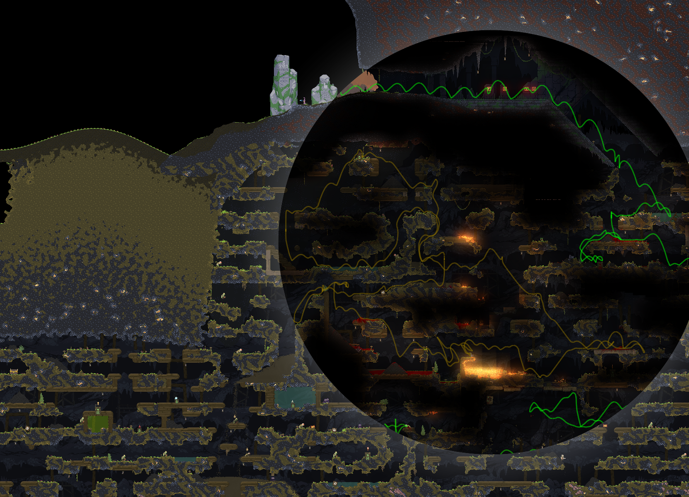
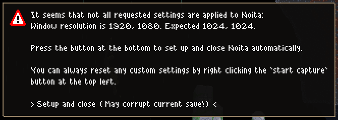
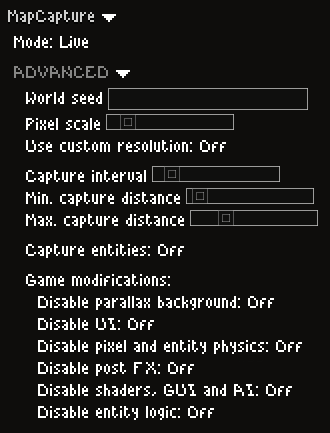
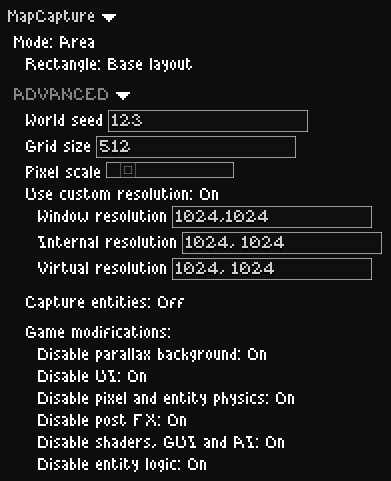

# Noita map capture addon

A mod for Noita that can capture images of the world and stitch them into one large image.
It works with the regular Noita build and the dev build.

Map captures created with this mod can be viewed on [map.runfast.stream] (may contain spoilers).

If you are interested in creating similar captures, or if you want to contribute your own captures to [map.runfast.stream], you can take a look at [github.com/acidflow-noita/noitamap].
There you'll find detailed step-by-step instructions on how to quickly capture large parts of the Noita world with as little visual glitches and other issues as possible.

## System requirements

- Windows Vista, ..., 10, 11. (64 bit OS for stitching)
- A few GB of free drive space.
- 4 or more GB of RAM for gigapixel images. (But it works with less as long as the software doesn't run out of virtual memory)

## Installation

1. Have Noita installed.
2. Download the [latest release of the mod from this link](https://github.com/Dadido3/noita-mapcap/releases/latest) (The `noita-mapcap-windows-amd64.zip`, not the source code)
3. Unpack it into your mods folder, so that you get the following file structure `.../Noita/mods/noita-mapcap/mod.xml`.
  You can open the mods folder by clicking `Open mod folder` from within the Noita mod menu.
4. Refresh the mod list.
5. Enable the `MapCapture` mod.

## Usage

You can use the mod with either the regular Noita version, or the dev build `noita_dev.exe` that is located in the game installation directory.
Using `noita_dev.exe` has the advantage that you can freeze pixel and rigid body simulations. Also, it uses a different location for its savegames, which means you don't have to worry about any save you may have left unfinished on the regular build.

Every setting you want or need to change can be found inside the `mod settings` tab of the game options.
By default the mod settings will be set to useful values.
An explanation for every setting can be found in the [Mod settings](#mod-settings) section.

Once you have changed the mod settings to your liking you can start or resume a game with the mod enabled.
You may see message boxes that suggest actions.
This can happen if the mod detects game settings that do not align with what you have set in the mod settings.
All you need to do is follow the given instructions, like:

>  Most of the changes this mod does to Noita are non permanent and will be gone after a restart or a new game, except:
>
> - Window, internal and virtual resolutions, if requested.
> - Screen shake intensity, which will always be disabled.
>
> You can always *right* click  to reset the above mentioned settings back to Noita's default.

After all issues have been resolved you are free to start capturing.

To the top left of the window are 3 buttons:

- / Starts/Stops the capturing process based on your mod settings.
  You can always restart a capture, and it will resume where it was stopped.

-  Reveals the output directory in your file browser.
  This will contain raw screenshots and other recorded data that later can be stitched.

-  Reveals the stitching tool directory in your file browser.

To stitch the final result, click  to open the directory of the stitching tool.
Start `stitch.exe` and proceed with the default values.
After a few minutes the file `output.png` will be created.

>  See [stitcher/README.md](bin/stitch/README.md) for more information about all stitcher parameters.

## Mod settings

>  Use *right* mouse button to reset any mod setting to their default.

- `Mode`: Defines what the mod captures, and how it captures it:

  - `Live`: The mod will capture as you play along.
    The end result is a map with the path of your run.

  - `Area`: Captures a defined rectangle of the world.
    You can either use [predefined areas](AREAS.md), or enter custom coordinates.

  - `Spiral`: Will capture the world in a spiral.
    The center starting point of the spiral can either be your current viewport, the world center or some custom coordinates.

### Advanced mod settings

- `World seed`: If non empty, this will set the next new game to this seed.

- `Grid size`: The amount of world pixels the viewport will move between the screenshots.

- `Pixel scale`: The resulting pixel size of the screenshots.
  If greater than 0, all screenshots will be rescaled to have the given pixel size.

- `Use custom resolution`: If enabled, the mod will change the game resolutions to the given values.

- `Capture interval`: Interval between screen captures, when in live mode.

- `Min. capture distance`: The distance in world pixels the viewport has to move to allow another screenshot.
  Only used in live mode.

- `Max. capture distance`: The distance in world pixels the viewport has to move to force another screenshot.
  Only used in live mode.

- `Capture entities`: If enabled, the mod will capture all entities, their children, parameters and components and write them into `output/entities.json`.
  >  This can slow down capturing a bit, it may also make Noita more unstable.

- `Disable parallax background`: Will replace the world background with black pixels.

- `Disable UI`: Will disable inventory UI.
  But the UI can still appear if triggered by mouse wheel or something similar.

- `Disable pixel and entity physics`: Will disable/stop pixel and rigid body simulation.
  Only works in dev build.

- `Disable post FX`: Disables most postprocessing effects like:
  - Dithering
  - Refraction
  - Lighting
  - Fog of war
  - Glow
  - Gamma correction

- `Disable shaders, GUI and AI`: Also disables all postprocessing, any in-game UI and will freeze all mobs.
  Only works in dev build.

- `Disable entity logic`: Will modify all encountered entities:
  - Disables AI
  - Disables falling
  - Disables hovering and rotation animations
  - Reduces explosions

  >  This can slow down capturing a bit, it may also make Noita more unstable.

### Example settings

Use these settings if you want to capture your in-game action.
The sliders are at their default values:

Use these settings to capture the [base layout](AREAS.md#base-layout) with the least amount of glitches and artifacts.
The sliders are at their default values:

## Troubleshooting

### Noita crashes a lot

There is not a lot you can do about it:

- ~~You can try to increase the usable address space of your `.../Noita/noita_dev.exe` or `.../Noita/noita.exe` with [Large Address Aware] or a similar tool.
  This will help with any crashes that are related to out of memory exceptions.~~
  `Large Address Aware` is already set in newer Noita builds.

- You can disable the replay recorder.

More information/details about this can be found [here](https://github.com/Dadido3/noita-mapcap/issues/7#issuecomment-723571110).

### I get "ASSERT FAILED!" messages

These can't really be prevented.
All you can do is to click `Ignore always`.

Alternatively you can run the same capture in the regular Noita (non dev build), which has these messages disabled.
With the exception that you can't disable the pixel and rigid body simulations, the mod works just as well as in the dev build.

### The mod messed up my game

Custom resolution settings are retained even if you restart Noita or start a new game.
In the worst case they will cause the game world to not render correctly, or they will make your game only use a fraction of the window.

To reset any permanent settings that may have been set by the mod:

1. Enable the mod.
2. Start a new game.
3. *Right* click  and follow instructions.

>  If you have changed any resolutions in your game's `config.xml`, you may have to re-apply these changes.
> This also applies if you use any mods that makes Noita work on ultra-wide screens.
> For these mods to work again after a reset, you need to go through their installation steps again.

Alternatively, you can reset **all** game settings by deleting:

- `"%appdata%\..\LocalLow\Nolla_Games_Noita\save_shared\config.xml"` for the regular Noita.
- `"...\Noita\save_shared\config.xml"` for the dev build.

### The objects in the stitched image are blurry

The stitcher uses median blending to remove any single frame artifacts and to correct for not rendered chunks.
This will cause fast moving objects to completely disappear, and slow moving objects to get blurry.

To disable median blending, use the stitcher with `Blend tile limit` set to 1.
This will cause the stitcher to only use the newest image tile for every resulting pixel.

## Viewing and hosting captures

The resulting stitched images are quite big.
You can read [this comment](https://github.com/Dadido3/noita-mapcap/issues/7#issuecomment-723591552) that addresses how you can view, convert or even self-host your images.

You can use [github.com/Dadido3/noita-mapcap-openseadragon] if you want to host a browser based viewer on your own web space.

If you want to make your captures available to a wider audience, you should check out the [github.com/acidflow-noita/noitamap] project, which aims to make maps of all game modes (including mods) available to the public.

## Acknowledgements

This mod uses the [LuaNXML] library by [Zatherz].

Thanks to [Daniel Niccoli](https://github.com/danielniccoli) for figuring out how to change some in-game options by manipulating process memory.

## License

[MIT](LICENSE)

[github.com/acidflow-noita/noitamap]: https://github.com/acidflow-noita/noitamap
[github.com/Dadido3/noita-mapcap-openseadragon]: https://github.com/Dadido3/noita-mapcap-openseadragon
[Large Address Aware]: https://www.techpowerup.com/forums/threads/large-address-aware.112556/
[LuaNXML]: https://github.com/zatherz/luanxml
[map.runfast.stream]: https://map.runfast.stream
[Zatherz]: https://github.com/zatherz
